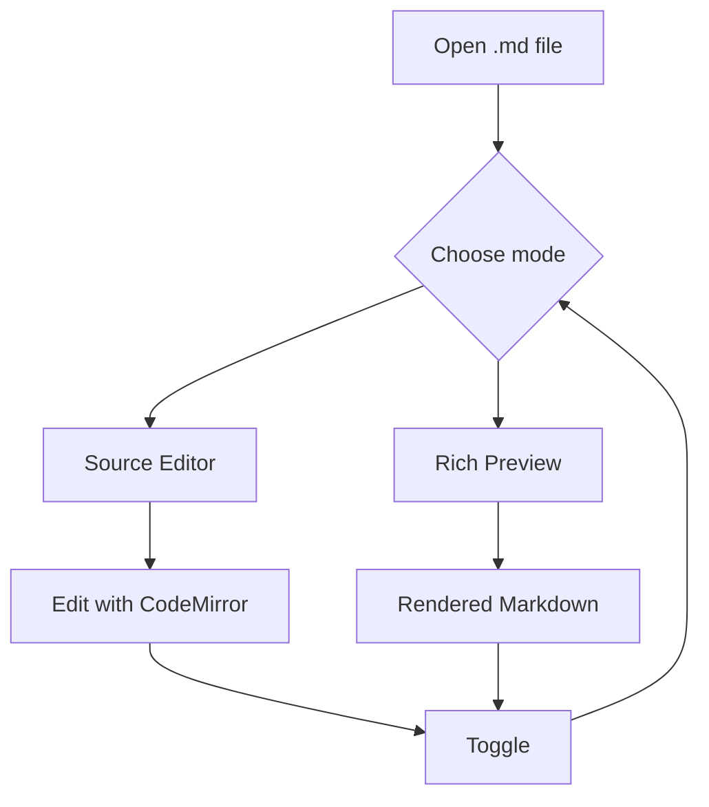
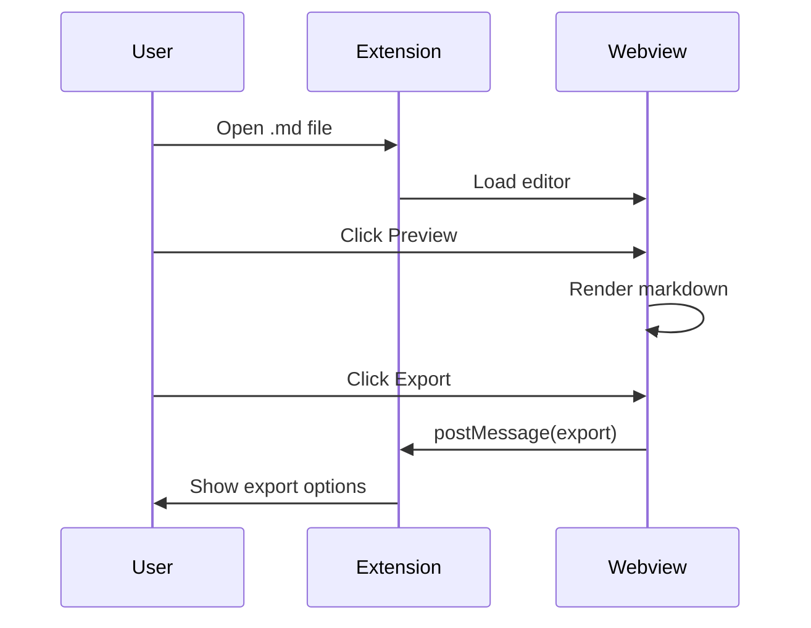

# Markdown Ultimate — Example

${toc}

## Text Formatting

This is **bold**, *italic*, and ~~strikethrough~~.

Here's a [link](https://github.com) and some `inline code`.

## Emoji

:rocket: :tada: :smile: :heart: :fire: :star:

## Task Lists

- [x] Toggle preview in the same tab
- [x] KaTeX math rendering
- [x] Mermaid diagrams
- [ ] Try the export feature
- [ ] Star the repo :star:

## Code Block

```typescript
function greet(name: string): string {
  return `Hello, ${name}!`;
}

console.log(greet("Markdown Ultimate"));
```

## Table

| Feature | Shortcut |
|---------|----------|
| Bold | `Cmd+B` |
| Italic | `Cmd+I` |
| Strikethrough | `Alt+S` |
| Heading Up | `Cmd+Shift+]` |
| Heading Down | `Cmd+Shift+[` |
| Checkbox | `Alt+C` |

## KaTeX Math

Inline math: $E = mc^2$

Block math:

$$
\int_{-\infty}^{\infty} e^{-x^2} dx = \sqrt{\pi}
$$

$$
\sum_{n=1}^{\infty} \frac{1}{n^2} = \frac{\pi^2}{6}
$$

## Mermaid Diagram





## Blockquote

> "The best markdown editor is the one that gets out of your way."
>
> — Every developer, probably

## Horizontal Rule

---

## Image


